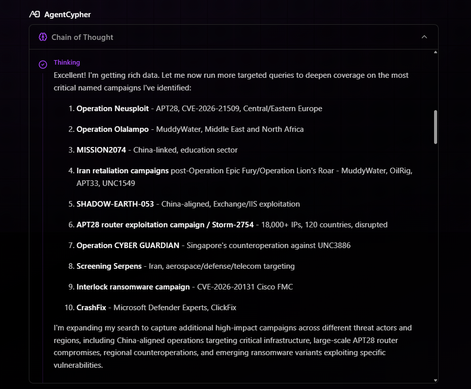

# AgentCypher — Agentic Cyber Threat Intelligence

**Case study. Source code withheld (patent pending).** This repo documents the architecture and product of AgentCypher, an agentic CTI platform I build for security leaders. It's here to show the system design and my role, not to distribute the code.

🔗 **Live:** https://agentcypher.ai

## What it does

CISOs drown in threat intelligence: thousands of articles a week, dozens of feeds, and no time to separate what matters to *their* organization from the noise. AgentCypher is an AI analyst that does that separation for them.

It synthesizes **40,000+ cyber news articles and 30+ threat feeds** into intelligence tailored to a specific organization — its sector, region, size, compliance regime, and security stack — and explains not just *what* the threats are but *why they matter to you*.

**Landed 3 enterprise design partners: Magnetar, AutoZone, and Dykema.**

## What it looks like

*The agent running deep research across named, time-bound threat campaigns (APT28, UNC3886, and others) — combining curated threat-intel feeds, daily cyber news, and live web search, then reasoning over the results to surface what's CISO-relevant.*

## How it works

**An agentic analyst, not a search box.** The system runs a research loop: it decomposes a question, pulls from multiple intelligence sources in parallel, reads deeply into the highest-signal results, and synthesizes a briefing. The screenshot above shows this in motion — deep research, live web search, and reasoning steps, transparently.

**Intelligence tooling via MCP.** The agent's capabilities are exposed as Model Context Protocol tools:
- **Deep Research** — vector search over a curated CTI corpus
- **PulseDive** — structured threat-indicator lookups (domains, IPs, actors)

**Organization-aware.** Each tenant configures a profile (sector, regions, size, compliance, security stack) so intelligence is scored and framed for *their* risk, not generic feeds.

**Scheduled intelligence.** Recurring queries run on a schedule and produce standing briefings, so the platform delivers intelligence proactively rather than only on demand.

**Token economics that make it viable.** Long analyst conversations are expensive. An intelligent summarization service reduces message-history token usage by **85–90%**, keeping 100k-word conversations coherent and affordable.

## Architecture

**Today — production, live with design partners:**
A microservices system: an agent API with session management, the two MCP intelligence tools, a summarization service for token reduction, and a testing UI. Deployed and running for live partner evaluation.

**Enterprise SaaS build-out (in progress):**
- **Frontend:** Next.js, TypeScript, React, CopilotKit
- **Streaming:** an AG-UI layer that streams the agent's reasoning and tool use in real time
- **Orchestration:** a facade layer that isolates and coordinates the backend services
- **Data:** Supabase, with a message-history system built for long conversations
- **Enterprise auth:** Frontegg for hosted login, SAML SSO, and SCIM user lifecycle; authorization enforced at the database via Supabase RLS keyed on Frontegg JWT claims (tenant + user), with SCIM deprovisioning that revokes access immediately

## My role

Founder and builder. I designed the agent, the CTI tooling, the microservices architecture, the token-optimization layer, and the enterprise auth/tenancy model, and I run it in production with design partners.

## Stack

Python · PydanticAI · MCP · FastAPI · Next.js · TypeScript · Supabase · Frontegg · AWS

---

*Source code is not published — the core system is proprietary with a patent pending. This case study describes the architecture and product; for a deeper technical walkthrough, reach me at mayottekyle@gmail.com.*
